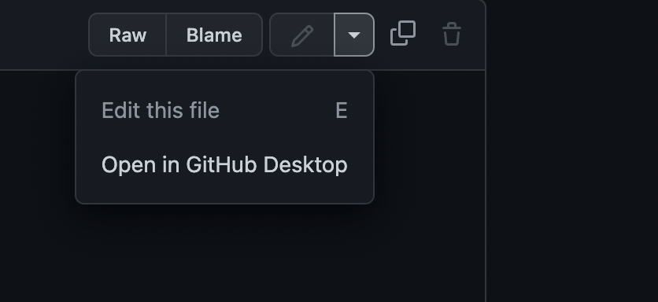

# Come aggiungere una nuova community

Al momento il processo per aggiungere una community non è automatizzato e sarà revisionato da parte del team di SpaghettETH

**Seleziona il file**

Il file per aggiungere una community si trova nella cartella `src` ed ha il nome di `communitiesData.json`

Una volta all'interno del file cliccare sull'icona della penna in alto a destra.



**Edita il file**

Per aggiungere la propria community basta aggiungere una entry al file json personalizzandola con i propri dati.

``` json
{
    "città": "Torino",
    "regione": "piemonte",
    "nome": "ethTurin",
    "membri": 10,
    "meet": "Incontri saltuari in presenza - Incontri saltuari virtuali",
    "format": "Ricerca e Sviluppo - Educazione",
    "focus": "Public Goods & Registries - Smart Contract Programming - NFTs - Legal, Adoption, Regulators",
    "progetti": "ETHTurin2020 - SpaghettETH - On-chain music copyright management Dapp - Crypto Open Mic",
    "twitter": "https://twitter.com/ethturin",
    "github": "https://github.com/ethturin",
    "telegram": "/",
    "discord": "https://discord.gg/GEhgmxkrAZ",
    "website": "ethturin.com",
    "partnership": "Legal Hackers Torino, UniTO",
    "multisig": "eth:0xdF5F3eb665952DAa6De7E520B57BdA322E22D4ba"
  }
  ```
  >esempio di una community

  Copia e incolla (ricordati di separare sul codice la entry precendente con una virgola)


``` json
{
    "città": "",
    "regione": "",
    "nome": "",
    "membri": ,
    "meet": "",
    "format": "",
    "focus": "",
    "progetti": "",
    "twitter": "",
    "github": "",
    "telegram": "",
    "discord": "",
    "website": "",
    "partnership": "",
    "multisig": ""
  }
  ```

## Nota bene

Prendendo ad esempio la community sopra (non quella vuota) attieniti alle seguenti guidlines
* **regione**: inserisci il nome della regione minuscolo
* **Link e social vari**: inserisci sempre l'URL completo, non il nome del social precedeuto da @ (es: **SI** https://twitter.com/ethturin **NO** @ethturin)
* **Spazi**: Per questioni di stile (e spazio) separa ciò che scrivi con "-" e non tramite "," o ";"
* **buon senso**: sii sintetico e vai dritto al punto.
